# DependWatch Architecture Diagrams

Mermaid diagrams for Excalidraw recreation, team onboarding, investor/product explanation, and AI handoff. Terminology matches **docs/DEPENDWATCH_SOURCE_OF_TRUTH.md**.

---

## 1. High-level system architecture

**What it shows:** Main building blocks and connections (users, app, API, data, Stripe, Slack).  
**Why it matters:** Executive overview; good first diagram for Excalidraw.

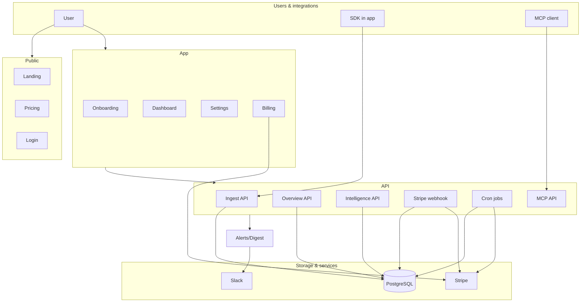

---

## 2. Route / application structure

**What it shows:** Major route groups (public, app, dashboard, settings).  
**Why it matters:** Codebase navigation and URL structure.

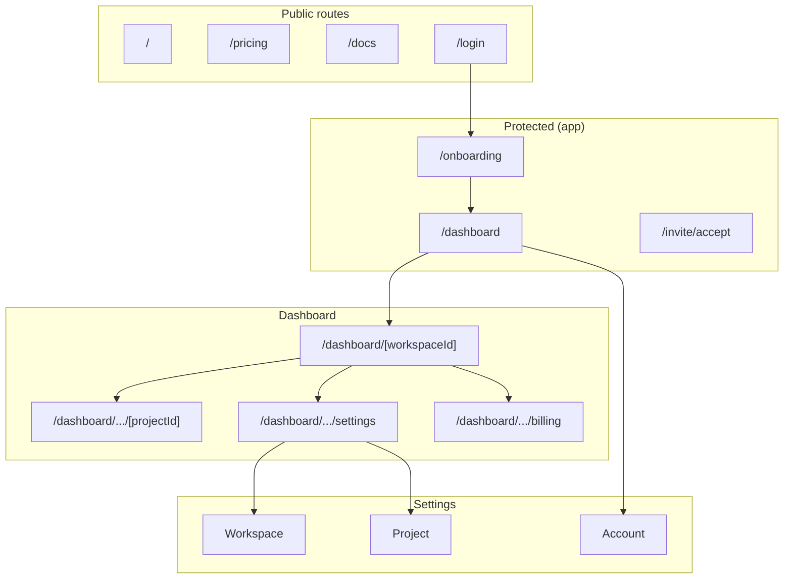

---

## 3. Authentication flow

**What it shows:** How a user signs in, gets a session, and is routed to onboarding vs dashboard.  
**Why it matters:** Explains protected routes and first-run behavior.

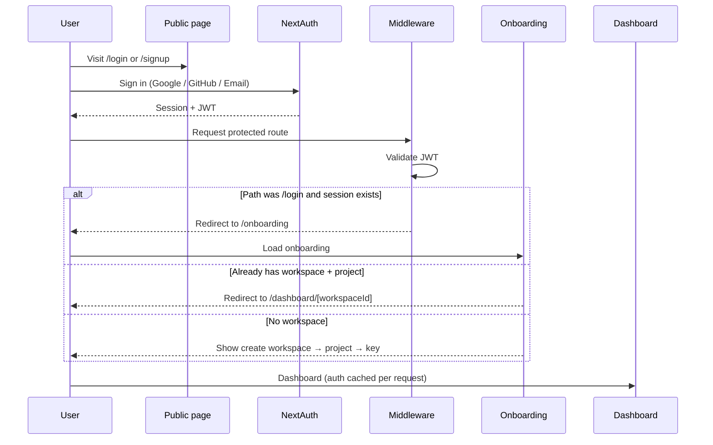

---

## 4. Onboarding flow

**What it shows:** Steps from sign-in to first dashboard view and activation.  
**Why it matters:** Core activation and where the ingest key is shown once.

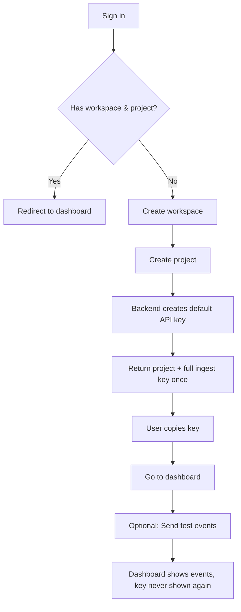

---

## 5. Event ingestion flow

**What it shows:** Three entry points (SDK, test events, MCP), single write path, and how source (sdk vs demo) affects usage and cost.  
**Why it matters:** Core data path; demo exclusion is critical for billing.

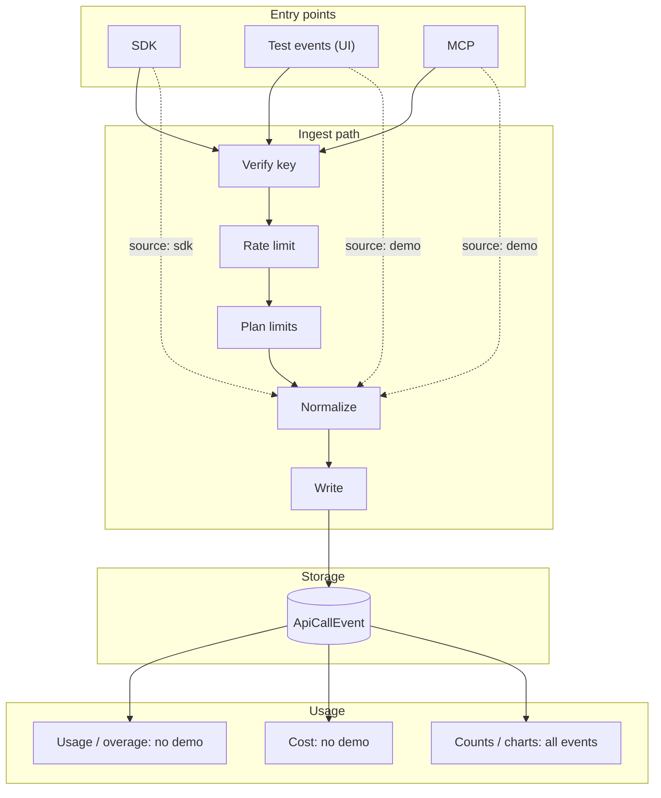

---

## 6. Dashboard data flow

**What it shows:** Overview API (fast first paint) vs Intelligence API (lazy); which UI sections use which API.  
**Why it matters:** Performance and plan gating (dependency map, custom range).

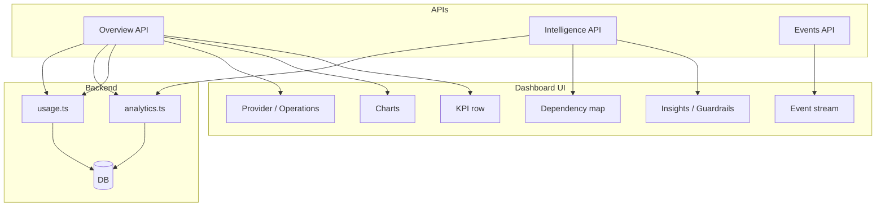

---

## 7. Alerts flow

**What it shows:** Alert rules, evaluation, cooldown, Slack delivery, and how the scheduler triggers evaluations.  
**Why it matters:** Clarifies what is real (Slack only, no email) and how scheduling works.

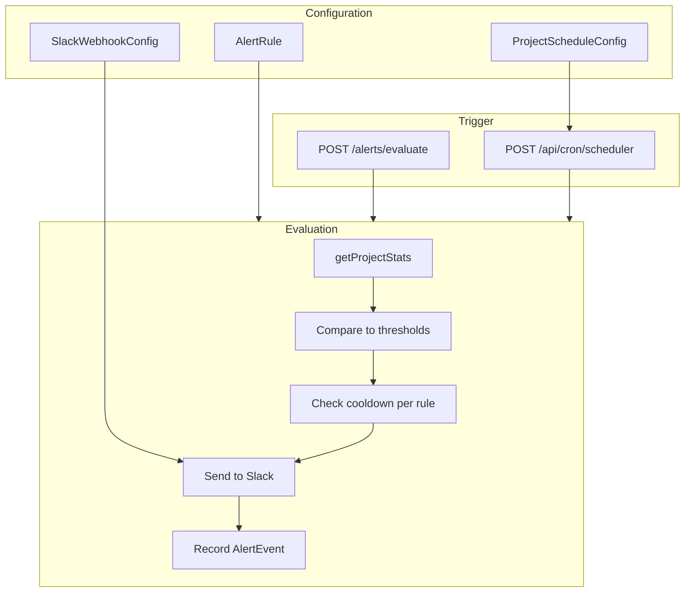

---

## 8. Digest flow

**What it shows:** Digest preview (in-app), digest delivery (to Slack), and native scheduling via cron.  
**Why it matters:** Shows built-in scheduling and that delivery is Slack-only.

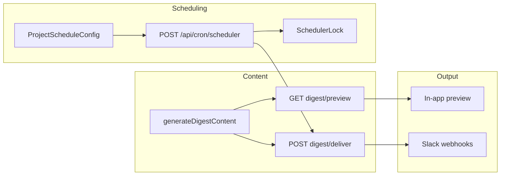

---

## 9. Billing / Stripe flow

**What it shows:** Billing page → Checkout → Stripe → webhook → Subscription in DB; overage cron adds invoice items.  
**Why it matters:** Monetization and plan sync (planId, period).

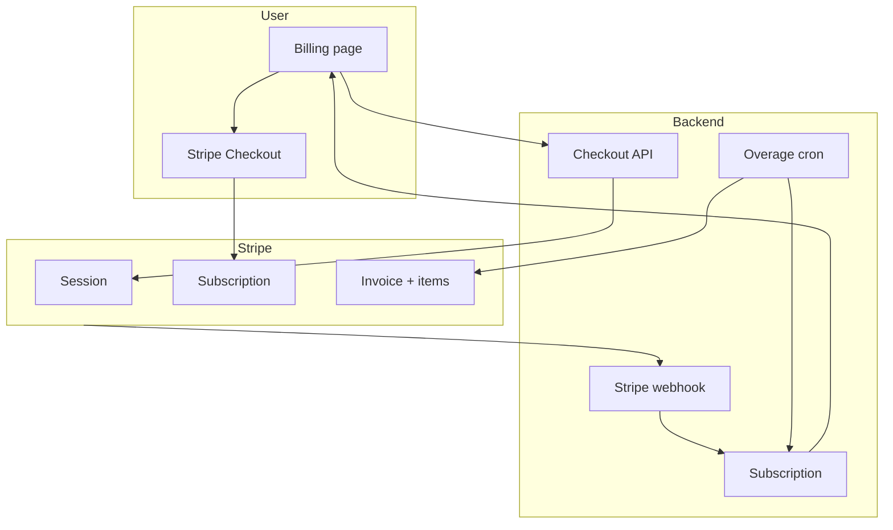

---

## 10. Plan enforcement and usage limits

**What it shows:** Where plan limits are defined and enforced (ingest, alerts, dashboard, usage, overage).  
**Why it matters:** Single place to see “who enforces what.”

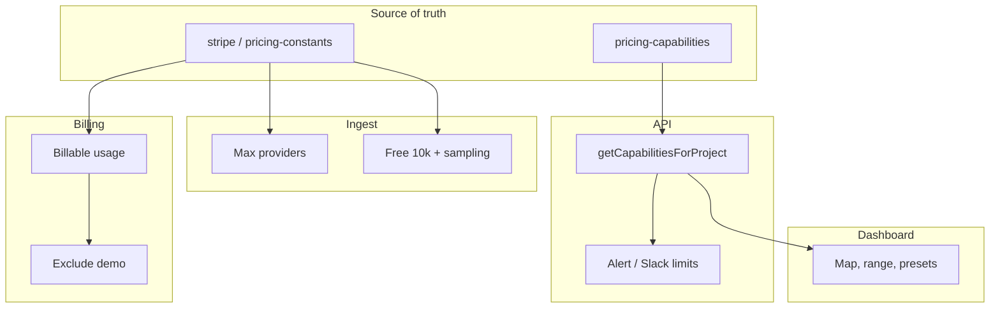

---

## 11. Settings architecture

**What it shows:** Split between workspace, project, and account settings with examples.  
**Why it matters:** Where to add new settings and how they are scoped.

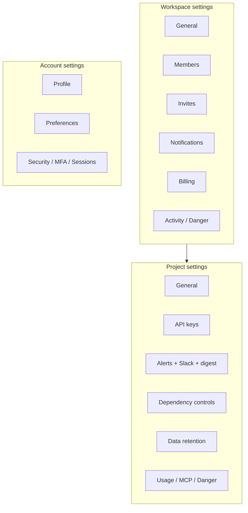

---

## 12. Permission model

**What it shows:** Roles and which actions they can perform; backend enforcement.  
**Why it matters:** Security and where to add permission checks.

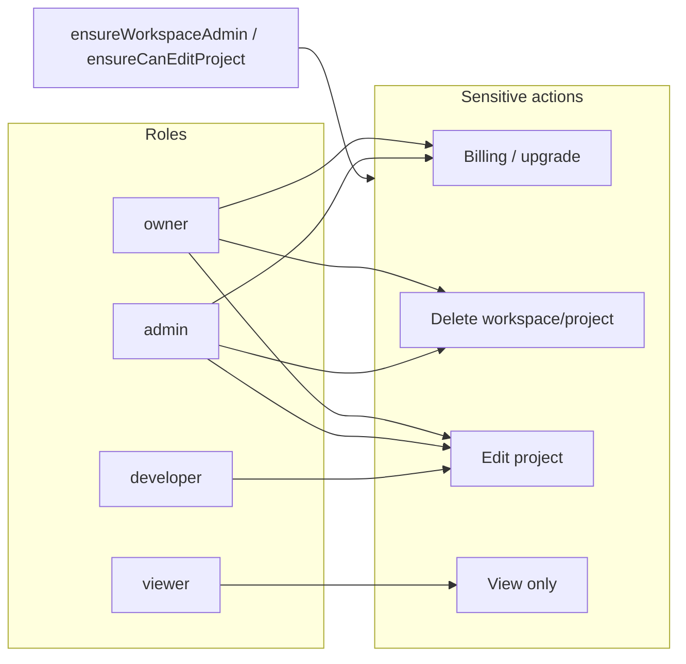

---

## 13. MCP / AI assistant integration

**What it shows:** MCP endpoint, public vs authenticated tools, and how tokens scope access.  
**Why it matters:** Explains how Cursor/Claude (or other clients) interact with DependWatch.

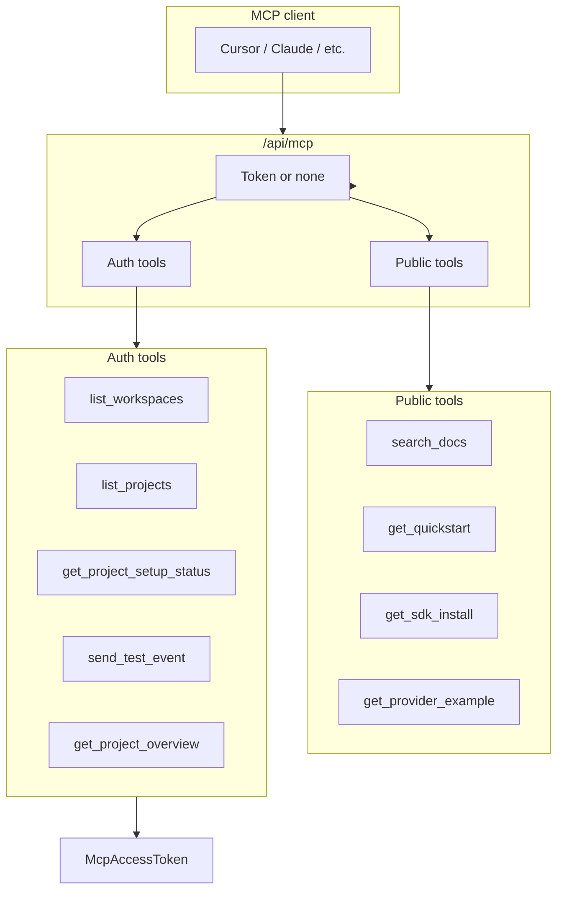

---

## 14. Core entity relationships

**What it shows:** Key entities and relationships (conceptual).  
**Why it matters:** Data model at a glance.

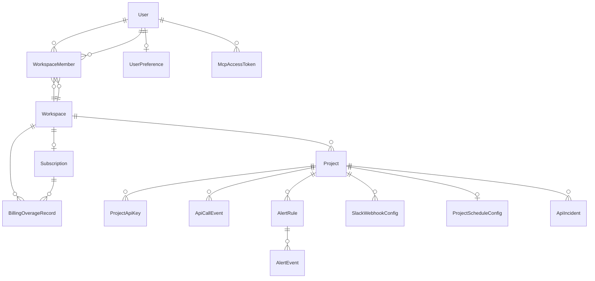

---

## 15. Demo vs real event semantics

**What it shows:** source = sdk vs demo: what counts in totals vs usage/cost/billing.  
**Why it matters:** Trust and correct billing (demo never billed).

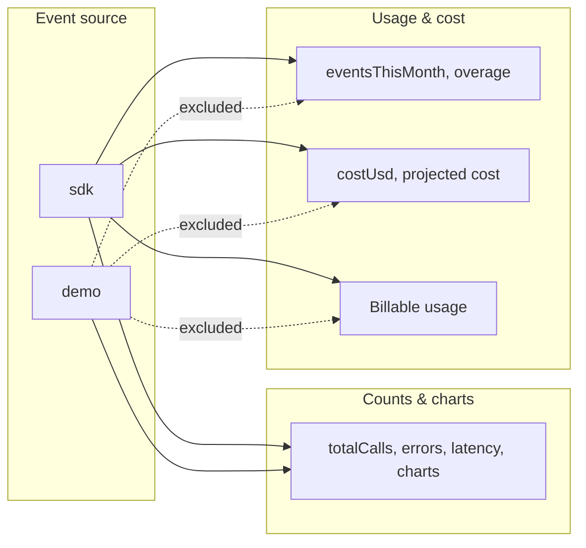

---

## Diagram index

| # | Diagram | Best for |
|---|---------|----------|
| 1 | High-level system architecture | Investors, executive overview |
| 2 | Route / application structure | Codebase navigation |
| 3 | Authentication flow | Security and onboarding |
| 4 | Onboarding flow | Activation and key handling |
| 5 | Event ingestion flow | Engineering, billing correctness |
| 6 | Dashboard data flow | Frontend and API design |
| 7 | Alerts flow | Alerting and Slack integration |
| 8 | Digest flow | Digest and scheduling |
| 9 | Billing / Stripe flow | Monetization and ops |
| 10 | Plan enforcement | Limits and gating |
| 11 | Settings architecture | Where to add settings |
| 12 | Permission model | Security and roles |
| 13 | MCP integration | AI assistant integration |
| 14 | Core entity relationships | Data model |
| 15 | Demo vs real semantics | Trust and billing |

---

## Summary

**File:** `docs/DEPENDWATCH_ARCHITECTURE_DIAGRAMS.md`

**Diagrams included:**  
1. High-level system architecture  
2. Route / application structure  
3. Authentication flow  
4. Onboarding flow  
5. Event ingestion flow  
6. Dashboard data flow  
7. Alerts flow  
8. Digest flow  
9. Billing / Stripe flow  
10. Plan enforcement and usage limits  
11. Settings architecture  
12. Permission model  
13. MCP / AI assistant integration  
14. Core entity relationships  
15. Demo vs real event semantics  

**Best starting point for Excalidraw:**

| Audience | Start with these diagrams |
|----------|----------------------------|
| **Team onboarding** | 1. High-level system architecture, 4. Onboarding flow |
| **Investor / product** | 1. High-level system architecture, 9. Billing / Stripe flow |
| **Engineering handoff** | 5. Event ingestion flow, 6. Dashboard data flow, 15. Demo vs real semantics |

**Second pass applied:** Diagrams were simplified for readability and Excalidraw: shorter box labels, clearer subgraph names, consistent flow direction (TB/LR), and terminology aligned with DEPENDWATCH_SOURCE_OF_TRUTH.md. Each diagram is focused so it can be recreated as one clear visual.
